# Registration of Tungsten fibres on XCT images

This demo aims to demonstrate the use of [gVirtualXRay](http://gvirtualxray.sourceforge.net/) and mathematical optimisation to register polygon meshes onto X-ray microtomography (micro-CT) scans of a tungsten fibre. Below is an example of CT slice.

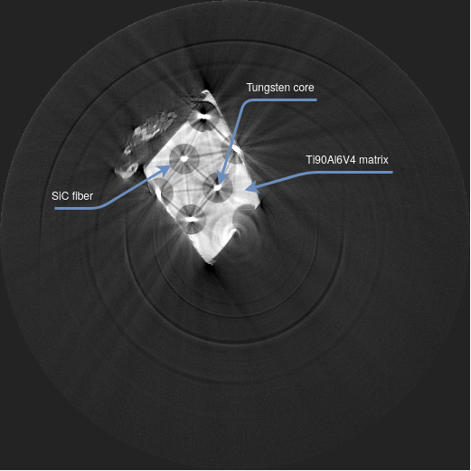

Our simulations include **beam-hardening** due to polychromatism and they take into account the **response of the detector**.

We use SimpleGVXR's Python wrapper and Python packages commonly used in tomography reconstruction ([Tomopy](https://tomopy.readthedocs.io/en/latest/)), image processing ([scikit-image](https://scikit-image.org/) and [SimpleITK](https://simpleitk.org/)), computer vision ([OpenCV](https://www.opencv.org/)), and non-linear numerical optimization ([CMA-ES, Covariance Matrix Adaptation Evolution Strategy](https://github.com/CMA-ES/pycma)).

## Import packages

We need to import a few libraries (called packages in Python). We use:

- `copy`: duplicating images using deepcopies;
- `math`: the `floor` function;
- `os`: creating a new directory
- `glob`: retrieving file names in a directory;
- `numpy`: who doesn't use numpy?
- `imageio`: creating GIF files;
- `skimage`: comparing the reference CT slice and the simulated one, computing the Radon transform of an image, and perform a CT reconstruction using FBP and SART;
- `tomopy`: another package for CT reconstruction;
- `SimpleITK`: image processing and saving volume data;
- OpenCV (`cv2`): Hough transform and bilateral filter (an edge-preserving smoothing filter);
- `matplotlib`: plotting data;
- `cma`: non-linear numerical optimization;
- `lsf`: the line spread function to filter the X-ray images; and
- `gvxrPython3`: simulation of X-ray images using the Beer-Lambert law on GPU.


```python
import copy, math, os, glob

import numpy as np

import imageio
from skimage.transform import radon, iradon, iradon_sart
from skimage.util import compare_images

import tomopy

import SimpleITK as sitk


import cv2

import cma

import matplotlib.pyplot as plt
import matplotlib.image as mpimg
from matplotlib.colors import LogNorm
from matplotlib import cm

plt.rcParams['figure.figsize'] = [12, 8]
plt.rcParams['figure.dpi'] = 100 # 200 e.g. is really fine, but slower

#from FlyAlgorithm import *
from lsf import *

import gvxrPython3 as gvxr
```


```python
if not os.path.exists("Tutorial2/outputs"):
    os.makedirs("Tutorial2/outputs");

if not os.path.exists("Tutorial2/plots"):
    os.makedirs("Tutorial2/plots");
```

## Global variables

We need some global variables.

- `g_reference_CT`: The reference XCT slice;
- `g_reference_sinogram`: The Radon transform of the reference XCT slice;
- `g_pixel_spacing_in_micrometre` and `g_pixel_spacing_in_mm`: The physical distance between the centre of two successive pixel;
- `g_number_of_projections`: The total number of angles in the sinogram;
- `g_angular_span_in_degrees`: The angular span covered by the sinogram;
- `g_angular_step`: the angular step; and
- `g_theta`: The rotation angles in degrees (vertical axis of the sinogram).


```python
g_pixel_spacing_in_micrometre = 1.9;
g_pixel_spacing_in_mm = g_pixel_spacing_in_micrometre * 1e-3;
g_number_of_projections = 900;
g_angular_span_in_degrees = 180.0;
g_angular_step = g_angular_span_in_degrees / g_number_of_projections;
g_theta = np.linspace(0., g_angular_span_in_degrees, g_number_of_projections, endpoint=False);
```

## Load the image data

Load and display the reference projections from a raw binary file, i.e. the target of the registration.


```python
# Target of the registration
reference_normalised_projections = np.fromfile("Tutorial2/sino.raw", dtype=np.float32);
reference_normalised_projections.shape = [g_number_of_projections, int(reference_normalised_projections.shape[0] / g_number_of_projections)];
```


```python
#np.savetxt("Tutorial2/outputs/reference_sinogram.txt", reference_normalised_projections);
volume = sitk.GetImageFromArray(reference_normalised_projections);
volume.SetSpacing([g_pixel_spacing_in_mm, g_angular_step, g_pixel_spacing_in_mm]);
sitk.WriteImage(volume, 'Tutorial2/outputs/reference_normalised_projections.mha', useCompression=True);
```


```python
labels=[g_theta[0], g_theta[reference_normalised_projections.shape[0] // 2], g_theta[-1]];
tics=[0, reference_normalised_projections.shape[0] // 2, reference_normalised_projections.shape[0]-1];
fig=plt.figure();
imgplot = plt.imshow(reference_normalised_projections, cmap="gray");
plt.xlabel("Displacement of projection");
plt.ylabel("Angle of projection (in degrees)");
plt.yticks(tics, labels);
plt.title("Normalised projections from the experiment at ESRF");
fig.colorbar(imgplot);
plt.savefig('Tutorial2/plots/Normalised_projections_from_experiment_ESRF.pdf')  
plt.savefig('Tutorial2/plots/Normalised_projections_from_experiment_ESRF.png')  
```


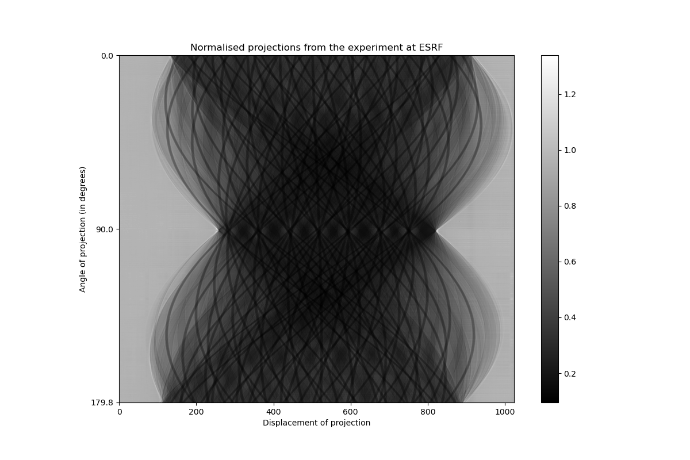


In the literature, a projection is often modelled as follows:

$$P = \ln\left(\frac{I_0}{I}\right) = -\ln\left(\frac{I}{I_0}\right) = \sum_n \mu(n) \Delta_x$$


`reference_normalised_projections` loaded from the binary file corresponds to $\frac{I}{I_0}$. The flat-field correction has already been performed. It is now necessary to linearise the transmission tomography data using:

$$-\ln(normalised\_projections)$$

This new image corresponds to the Radon transform, known as sinogram, of the scanned object in these experimental conditions. Once this is done, we divide the pixels of the sinogram by $\Delta_x$, which is egal to the spacing between two successive pixels along the horizontal axis.

We define a new function to compute the sinogram from flat-field correction and calls it straightaway.


```python
def computeSinogramFromFlatField(normalised_projections):
    simulated_sinogram = -np.log(normalised_projections);
    simulated_sinogram /= g_pixel_spacing_in_micrometre * gvxr.getUnitOfLength("um") / gvxr.getUnitOfLength("cm");

    return simulated_sinogram;
```


```python
g_reference_sinogram = computeSinogramFromFlatField(reference_normalised_projections);
```


```python
#np.savetxt("Tutorial2/outputs/reference_sinogram.txt", g_reference_sinogram);
volume = sitk.GetImageFromArray(g_reference_sinogram);
volume.SetSpacing([g_pixel_spacing_in_mm, g_angular_step, g_pixel_spacing_in_mm]);
sitk.WriteImage(volume, 'Tutorial2/outputs/reference_sinogram.mha', useCompression=True);
```


```python
labels=[g_theta[0], g_theta[g_reference_sinogram.shape[0] // 2], g_theta[-1]];
tics=[0, g_reference_sinogram.shape[0] // 2, g_reference_sinogram.shape[0]-1];
fig=plt.figure();
imgplot = plt.imshow(g_reference_sinogram, cmap="gray");
plt.xlabel("Displacement of projection");
plt.ylabel("Angle of projection (in degrees)");
plt.yticks(tics, labels);
plt.title("Sinogram of the reference image");
fig.colorbar(imgplot);
plt.savefig('Tutorial2/plots/Sinogram_reference_image.pdf');
plt.savefig('Tutorial2/plots/Sinogram_reference_image.png');
```


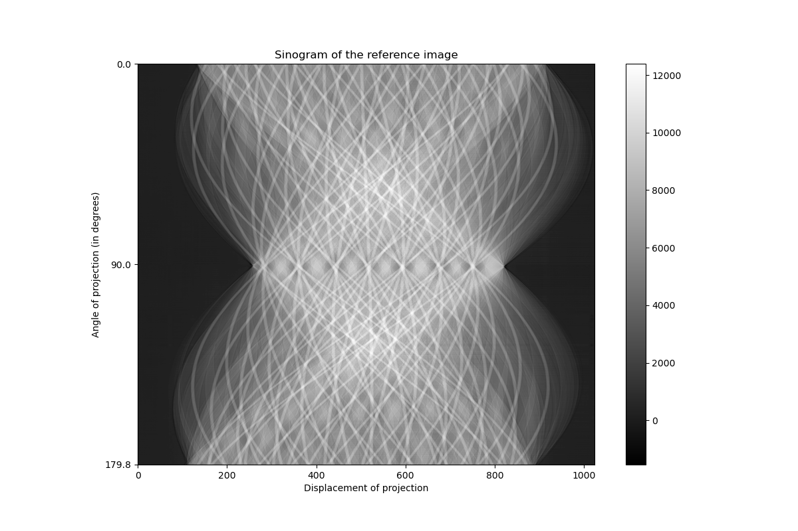


## CT reconstruction

Now we got a sinogram, we can reconstruct the CT slice. As we used a synchrotron, we can assume we have a parallel source. It means we can use a FBP rather than the FDK algorithm.


```python
g_reference_CT = iradon(g_reference_sinogram.T, theta=g_theta, circle=True);
```


```python
#np.savetxt("Tutorial2/outputs/reference_CT.txt", g_reference_CT);
volume = sitk.GetImageFromArray(g_reference_CT);
volume.SetSpacing([g_pixel_spacing_in_mm, g_angular_step, g_pixel_spacing_in_mm]);
sitk.WriteImage(volume, 'Tutorial2/outputs/reference_CT.mha', useCompression=True);
```


```python
fig=plt.figure();
norm = cm.colors.Normalize(vmax=50, vmin=0)
imgplot = plt.imshow(g_reference_CT, cmap="gray", norm=norm);
fig.colorbar(imgplot);
plt.title("Reference image (in linear attenuation coefficients, cm$^{-1}$)");
plt.savefig('Tutorial2/plots/reference_image_in_mu.pdf');
plt.savefig('Tutorial2/plots/reference_image_in_mu.png');
```


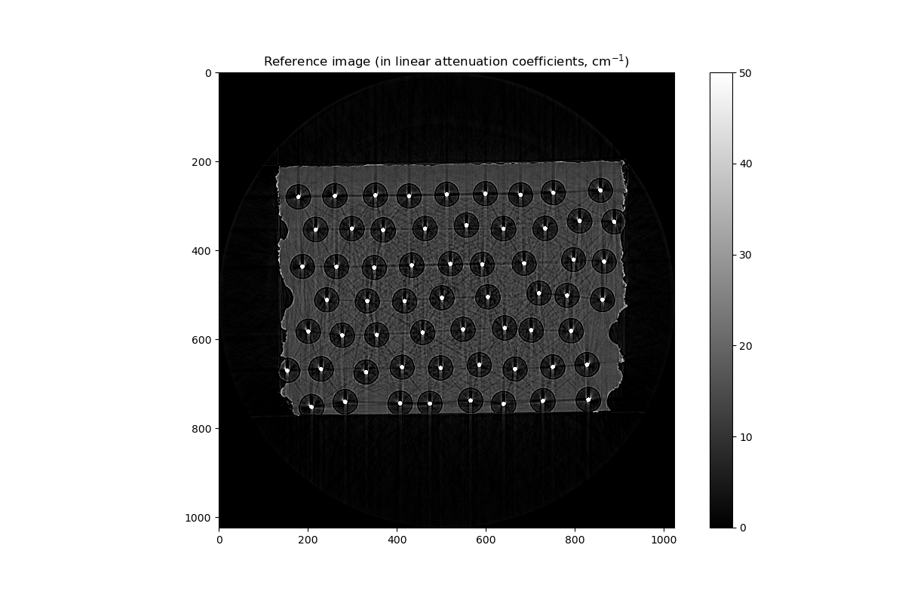


## Set the X-ray simulation environment

First we create an OpenGL context, here using EGL, i.e. no window.


```python
gvxr.createWindow(0, 1, "EGL");
gvxr.setWindowSize(512, 512);
```

We set the parameters of the X-ray detector (flat pannel), e.g. number of pixels, pixel, spacing, position and orientation:

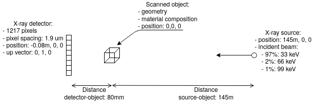


```python
detector_width_in_pixels = g_reference_sinogram.shape[1];
detector_height_in_pixels = 1;
distance_object_detector_in_m =    0.08; # = 80 mm

gvxr.setDetectorPosition(-distance_object_detector_in_m, 0.0, 0.0, "m");
gvxr.setDetectorUpVector(0, 1, 0);
gvxr.setDetectorNumberOfPixels(detector_width_in_pixels, detector_height_in_pixels);
gvxr.setDetectorPixelSize(g_pixel_spacing_in_micrometre, g_pixel_spacing_in_micrometre, "micrometer");
```

The beam specturm. Here we have a polychromatic beam, with 97% of the photons at 33 keV, 2% at 66 keV and 1% at 99 keV.


```python
energy_spectrum = [(33, 0.97, "keV"), (66, 0.02, "keV"), (99, 0.01, "keV")];

for energy, percentage, unit in energy_spectrum:
    gvxr.addEnergyBinToSpectrum(energy, unit, percentage);
```


```python
energies_in_keV = [];
weights = [];

for energy, percentage, unit in energy_spectrum:
    weights.append(percentage);
    energies_in_keV.append(energy * gvxr.getUnitOfEnergy(unit) / gvxr.getUnitOfEnergy("keV"));

fig=plt.figure();
plt.xlabel("Energy bin (in keV)");
plt.ylabel("Relative weight");
plt.xticks(energies_in_keV);
plt.yticks(weights);
plt.title("Incident beam spectrum");
plt.bar(energies_in_keV, weights);
plt.savefig('Tutorial2/plots/beam_spectrum.pdf');
plt.savefig('Tutorial2/plots/beam_spectrum.png');
```


And the source parameters (beam shape, source position)


```python
# Set up the beam
distance_source_detector_in_m  = 145.0;

gvxr.setSourcePosition(distance_source_detector_in_m - distance_object_detector_in_m,  0.0, 0.0, "mm");
gvxr.usePointSource();
gvxr.useParallelBeam();
```

The material properties (chemical composition and density)


```python
fibre_radius = 140 / 2; # um
fibre_material = [("Si", 0.5), ("C", 0.5)];
fibre_mu = 2.736; # cm-1
fibre_density = 3.2; # g/cm3

core_radius = 30 / 2; # um
core_material = [("W", 1)];
core_mu = 341.61; # cm-1
core_density = 19.3 # g/cm3

g_matrix_width = 0;
g_matrix_height = 0;
g_matrix_x = 0;
g_matrix_y = 0;
matrix_material = [("Ti", 0.9), ("Al", 0.06), ("V", 0.04)];
matrix_mu = 13.1274; # cm-1
matrix_density = 4.42 # g/cm3
```

### The LSF


```python
t = np.arange(-20., 21., 1.);
kernel=lsf(t*41)/lsf(0);
kernel/=kernel.sum();
```


```python
fig=plt.figure();
plt.title("Response of the detector (LSF)");
plt.plot(t,kernel);
plt.savefig('Tutorial2/plots/LSF.pdf');
plt.savefig('Tutorial2/plots/LSF.png');
```


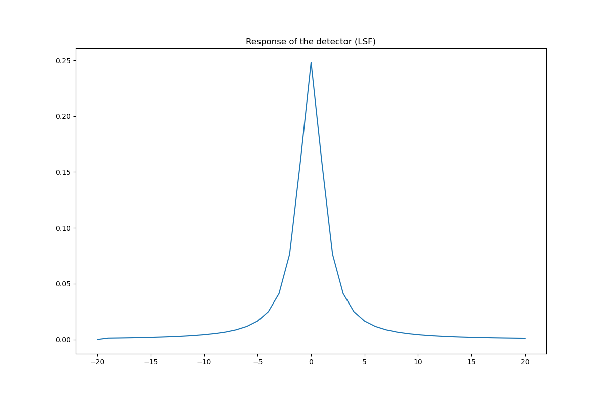


## Registration of a cube

## Normalise the image data

Zero-mean unit-variance normalisation is applied to use the reference images in objective functions and perform the registration. Note that it is called standardisation (Z-score Normalisation) in machine learning. It is computed as follows:

$$I' = \frac{I - \bar{I}}{\sigma}$$

Where $I'$ is the image after the original image $I$ has been normalised, $\bar{I}$ is the average pixel value of $I$, and $\sigma$ is its standard deviation.


```python
normalised_reference_sinogram = (g_reference_sinogram - g_reference_sinogram.mean()) / g_reference_sinogram.std();
normalised_reference_CT       = (g_reference_CT       - g_reference_CT.mean())       / g_reference_CT.std();
```


```python
#np.savetxt("outputs/normalised_reference_sinogram.txt", normalised_reference_sinogram);
volume = sitk.GetImageFromArray(normalised_reference_sinogram);
volume.SetSpacing([g_pixel_spacing_in_mm, g_angular_step, g_pixel_spacing_in_mm]);
sitk.WriteImage(volume, "Tutorial2/outputs/normalised_reference_sinogram.mha", useCompression=True);

#np.savetxt("outputs/normalised_reference_CT.txt", normalised_reference_CT);
volume = sitk.GetImageFromArray(normalised_reference_CT);
volume.SetSpacing([g_pixel_spacing_in_mm, g_pixel_spacing_in_mm, g_pixel_spacing_in_mm]);
sitk.WriteImage(volume, "Tutorial2/outputs/normalised_reference_CT.mha", useCompression=True);
```


```python
def setMatrix(apGeneSet):

    gvxr.removePolygonMeshesFromSceneGraph();

    # Matrix
    # Make a cube
    gvxr.makeCube("matrix", 1.0, "micrometer");

    # Translation vector
    x = apGeneSet[0] * detector_width_in_pixels * g_pixel_spacing_in_micrometre;
    y = apGeneSet[1] * detector_width_in_pixels * g_pixel_spacing_in_micrometre;

    gvxr.translateNode("matrix", x, 0.0, y, "micrometer");

    # Rotation angle
    rotation_angle_in_degrees = (apGeneSet[2] + 0.5) * 360.0;
    gvxr.rotateNode("matrix", rotation_angle_in_degrees, 0, 1, 0);

    # Scaling factors
    w = (apGeneSet[3] + 0.5) * detector_width_in_pixels * g_pixel_spacing_in_micrometre;
    h = (apGeneSet[4] + 0.5) * detector_width_in_pixels * g_pixel_spacing_in_micrometre;    
    gvxr.scaleNode("matrix", w, 815, h);

#     print("w:", w, "h:", h, "x:", x, "y:", y);

    # Apply the transformation matrix so that we can save the corresponding STL file
    gvxr.applyCurrentLocalTransformation("matrix");

    # Matrix
    gvxr.setMixture("matrix", "Ti90Al6V4");
    gvxr.setDensity("matrix", matrix_density, "g/cm3");

    gvxr.addPolygonMeshAsOuterSurface("matrix");
```

### Simulate the CT acquisition

Compute the raw projections and save the data. For this  purpose, we define a new function.


```python
def tomographyAcquisition():
    raw_projections_in_MeV = [];

    for angle_id in range(0, g_number_of_projections):
        gvxr.resetSceneTransformation();
        gvxr.rotateScene(-g_angular_step * angle_id, 0, 1, 0);

        # Compute the X-ray image
        xray_image = np.array(gvxr.computeXRayImage());

        # Add the projection
        raw_projections_in_MeV.append(xray_image);

    raw_projections_in_MeV = np.array(raw_projections_in_MeV);

    # Apply the LSF line by line
    for z in range(raw_projections_in_MeV.shape[0]):
        for y in range(raw_projections_in_MeV.shape[1]):
            raw_projections_in_MeV[z][y] = np.convolve(raw_projections_in_MeV[z][y], kernel, mode='same');

    raw_projections_in_keV = raw_projections_in_MeV / gvxr.getUnitOfEnergy("keV");

    return raw_projections_in_keV;
```

### Flat-filed correction

Because the data suffers from a fixed-pattern noise in X-ray imaging in actual experiments, it is necessary to perform the flat-field correction of the raw projections using:

$$normalised\_projections = \frac{raw\_projections − dark\_field}{flat\_field\_image − dark\_field}$$

- $raw\_projections$ are the raw projections with the X-ray beam turned on and with the scanned object,
- $flat\_field\_image$ is an image with the X-ray beam turned on but without the scanned object, and
- $dark\_field$ is an image with the X-ray beam turned off.

Note that in our example, $raw\_projections$, $flat\_field\_image$ and $dark\_field$ are in keV whereas $normalised\_projections$ does not have any unit:

$$0 \leq raw\_projections \leq  \sum_E N_0(E) \times E\\0 \leq normalised\_projections \leq 1$$

We define a new function to compute the flat-field correction.


```python
def flatFieldCorrection(raw_projections_in_keV):
    dark_field_image = np.zeros(raw_projections_in_keV.shape);
    flat_field_image = np.zeros(raw_projections_in_keV.shape);

    # Retrieve the total energy
    total_energy = 0.0;
    energy_bins = gvxr.getEnergyBins("keV");
    photon_count_per_bin = gvxr.getPhotonCountEnergyBins();

    for energy, count in zip(energy_bins, photon_count_per_bin):
        total_energy += energy * count;
    flat_field_image = np.ones(raw_projections_in_keV.shape) * total_energy;

    normalised_projections = (raw_projections_in_keV - dark_field_image) / (flat_field_image - dark_field_image);

    return normalised_projections;
```


```python
def simulateSinogram():
    raw_projections_in_keV = tomographyAcquisition();
    normalised_projections = flatFieldCorrection(raw_projections_in_keV);
    simulated_sinogram = computeSinogramFromFlatField(normalised_projections);

    return simulated_sinogram, normalised_projections, raw_projections_in_keV;
```


```python
def fitnessFunction(x):
    global best_fitness, matrix_id;
    setMatrix(x);

    # Simulate a sinogram
    simulated_sinogram, normalised_projections, raw_projections_in_keV = simulateSinogram();
    normalised_simulated_sinogram = (simulated_sinogram - simulated_sinogram.mean()) / simulated_sinogram.std();


    # Compute the fitness function
    MAE = np.mean(np.abs(np.subtract(normalised_simulated_sinogram.flatten(), normalised_reference_sinogram.flatten())));
#     ZNCC = np.mean(np.multiply(normalised_simulated_sinogram.flatten(), normalised_reference_sinogram.flatten()));


    # Save the data
    fitness = MAE;
    if best_fitness > fitness:
        best_fitness = fitness;

        gvxr.saveSTLfile("matrix", "Tutorial2/outputs/matrix_" + str(matrix_id) + ".stl");

        # Reconstruct the CT slice
        theta = g_theta / 180.0 * math.pi;
        rot_center = int(simulated_sinogram.shape[2]/2);
        reconstruction_tomopy = tomopy.recon(simulated_sinogram, theta, center=rot_center, algorithm="gridrec", sinogram_order=False);
        normalised_simulated_CT = (reconstruction_tomopy - reconstruction_tomopy.mean()) / reconstruction_tomopy.std();

        MAE_CT = np.mean(np.abs(np.subtract(normalised_simulated_CT.flatten(), normalised_reference_CT.flatten())));
        ZNCC_CT = np.mean(np.multiply(normalised_simulated_CT.flatten(), normalised_reference_CT.flatten()));

        normalised_simulated_sinogram.shape = (normalised_simulated_sinogram.size // normalised_simulated_sinogram.shape[2], normalised_simulated_sinogram.shape[2]);
        volume = sitk.GetImageFromArray(normalised_simulated_sinogram);
        volume.SetSpacing([g_pixel_spacing_in_mm, g_angular_step, g_pixel_spacing_in_mm]);
        sitk.WriteImage(volume, "Tutorial2/outputs/normalised_simulated_sinogram_" + str(matrix_id) + ".mha", useCompression=True);

        volume = sitk.GetImageFromArray(normalised_simulated_CT);
        volume.SetSpacing([g_pixel_spacing_in_mm, g_pixel_spacing_in_mm, g_pixel_spacing_in_mm]);
        sitk.WriteImage(volume, "Tutorial2/outputs/normalised_simulated_CT_" + str(matrix_id) + ".mha", useCompression=True);

        np.savetxt("Tutorial2/outputs/cube_" + str(matrix_id) + ".dat", x, header='x,y,rotation_angle,w,h');

        matrix_id += 1;

#     best_fitness = min(MAE, best_fitness);
        print("Best:", best_fitness, "MAE:", MAE, "ZNCC:", "%.2f" % (100*ZNCC_CT) + "%")

    return fitness;
```


```python
# The registration has already been performed. Load the results.
if os.path.isfile('Tutorial2/outputs/cube.dat'):
    current_best = np.loadtxt('Tutorial2/outputs/cube.dat');
# Perform the registration using CMA-ES
else:
    best_fitness = sys.float_info.max;
    matrix_id = 0;

    opts = cma.CMAOptions()
    opts.set('tolfun', 1e-3);
    opts['tolx'] = 1e-3;
    opts['bounds'] = [5*[-0.5], 5*[0.5]];

    es = cma.CMAEvolutionStrategy(5 * [0], 0.5, opts);
    es.optimize(fitnessFunction);

    current_best = copy.deepcopy(es.result.xbest); # [-0.12174177  0.07941929 -0.3949529  -0.18708068 -0.23998638]
    np.savetxt("Tutorial2/outputs/cube.dat", current_best, header='x,y,rotation_angle,w,h');
```

    (4_w,8)-aCMA-ES (mu_w=2.6,w_1=52%) in dimension 5 (seed=243244, Wed Jan 20 11:23:58 2021)
    Best: 1.0619452806410645 MAE: 1.0619452806410645 ZNCC: 7.88%
    Best: 0.4033513532627574 MAE: 0.4033513532627574 ZNCC: 23.38%
    Iterat #Fevals   function value  axis ratio  sigma  min&max std  t[m:s]
        1      8 4.033513532627574e-01 1.0e+00 4.28e-01  4e-01  4e-01 0:07.6
        2     16 4.545569142833768e-01 1.2e+00 3.55e-01  3e-01  4e-01 0:12.8
        3     24 6.703405930246032e-01 1.4e+00 3.05e-01  2e-01  3e-01 0:17.6
        4     32 6.016015866948323e-01 1.4e+00 2.49e-01  2e-01  2e-01 0:22.8
        5     40 6.580827635364503e-01 1.5e+00 2.05e-01  1e-01  2e-01 0:27.9
        6     48 4.036938249245380e-01 1.6e+00 1.71e-01  1e-01  2e-01 0:33.0
    Best: 0.36276161498028336 MAE: 0.36276161498028336 ZNCC: 25.60%
        8     64 4.548163836697646e-01 2.1e+00 1.91e-01  1e-01  2e-01 0:43.5
       10     80 4.458835332558058e-01 2.4e+00 1.79e-01  1e-01  2e-01 0:53.6
       12     96 5.241198521441434e-01 2.5e+00 1.68e-01  8e-02  2e-01 1:03.7
       14    112 4.394722466278280e-01 2.8e+00 1.37e-01  6e-02  2e-01 1:13.8
    Best: 0.2896235813227669 MAE: 0.2896235813227669 ZNCC: 26.42%
       16    128 3.057444189843898e-01 2.8e+00 1.32e-01  6e-02  1e-01 1:24.0
    Best: 0.2591829571045954 MAE: 0.2591829571045954 ZNCC: 29.13%
    Best: 0.23479592755259837 MAE: 0.23479592755259837 ZNCC: 29.18%
       19    152 2.347959275525984e-01 2.8e+00 1.10e-01  4e-02  1e-01 1:39.3
    Best: 0.218095541750028 MAE: 0.218095541750028 ZNCC: 29.11%
       22    176 2.180955417500280e-01 3.2e+00 6.82e-02  2e-02  6e-02 1:54.5
    Best: 0.21581928961861704 MAE: 0.21581928961861704 ZNCC: 29.64%
    Best: 0.21283631914294568 MAE: 0.21283631914294568 ZNCC: 29.77%
       25    200 2.186599904673225e-01 2.9e+00 4.40e-02  1e-02  3e-02 2:09.9
       28    224 2.183694786879585e-01 2.9e+00 3.89e-02  1e-02  3e-02 2:24.9
    Best: 0.20112501767912933 MAE: 0.20112501767912933 ZNCC: 30.06%
    Best: 0.1991497700582889 MAE: 0.1991497700582889 ZNCC: 30.09%
       31    248 1.991497700582889e-01 3.4e+00 2.62e-02  7e-03  2e-02 2:40.6
    Best: 0.19359902142971847 MAE: 0.19359902142971847 ZNCC: 30.12%
    Best: 0.19262810080200135 MAE: 0.19262810080200135 ZNCC: 30.39%
    Best: 0.19136035582327235 MAE: 0.19136035582327235 ZNCC: 30.39%
       35    280 1.913603558232723e-01 3.7e+00 1.93e-02  5e-03  1e-02 3:01.6
    Best: 0.18747814884223457 MAE: 0.18747814884223457 ZNCC: 30.37%
    Best: 0.18637696872247597 MAE: 0.18637696872247597 ZNCC: 30.45%
       39    312 1.863769687224760e-01 3.0e+00 1.47e-02  3e-03  8e-03 3:22.7
    Best: 0.18529616259306017 MAE: 0.18529616259306017 ZNCC: 30.51%
    Best: 0.1848853781064898 MAE: 0.1848853781064898 ZNCC: 30.65%
    Best: 0.18483246624903646 MAE: 0.18483246624903646 ZNCC: 30.59%
    Best: 0.18442708951173548 MAE: 0.18442708951173548 ZNCC: 30.59%
       43    344 1.844270895117355e-01 3.3e+00 8.29e-03  2e-03  4e-03 3:45.1
    Best: 0.1842651155555527 MAE: 0.1842651155555527 ZNCC: 30.63%
    Best: 0.18416497725955044 MAE: 0.18416497725955044 ZNCC: 30.63%
       47    376 1.845188911865274e-01 3.3e+00 5.57e-03  1e-03  3e-03 4:06.3
    Best: 0.18409532740097811 MAE: 0.18409532740097811 ZNCC: 30.66%
       51    408 1.840953274009781e-01 3.5e+00 3.63e-03  5e-04  2e-03 4:27.1
       56    448 1.841097547331099e-01 3.6e+00 2.74e-03  4e-04  1e-03 4:52.7
    Best: 0.18406673308493268 MAE: 0.18406673308493268 ZNCC: 30.69%
    Best: 0.18402551882318177 MAE: 0.18402551882318177 ZNCC: 30.71%
    Best: 0.18401357810814412 MAE: 0.18401357810814412 ZNCC: 30.69%
       59    472 1.840135781081441e-01 3.7e+00 2.50e-03  3e-04  1e-03 5:08.8


### Apply the result of the registration


```python
# Save the result    
setMatrix(current_best);
gvxr.saveSTLfile("matrix", "Tutorial2/outputs/matrix.stl");
```

### Display the result of the registration as an animation


```python
def createAnimation(aPrefix, anOutputFile):
    # Find all the images from the output directory
    files = sorted(
        glob.glob(aPrefix + "[0-9]*.mha"))

    # Store the images
    registration_image_set = [];

    # Create the GIF file
    with imageio.get_writer(anOutputFile, mode='I') as writer:

        # Store the PNG filenames
        png_filename_set = [];

        # Process all the images
        for i in range(len(files)):

            # Create the filenames
            mha_fname = aPrefix + str(i) + ".mha";
            png_filename_set.append(aPrefix + str(i) + ".png");

            # Open the MHA file
            float_image = sitk.ReadImage(mha_fname);

            # Convert in a Numpy array
            narray = sitk.GetArrayFromImage(float_image)[0];
            registration_image_set.append(narray);

            # Create the figure
            fig, (ax1, ax2, ax3) = plt.subplots(1, 3)

            # Dispay the reference, registration and error map
            fig.suptitle('Registration: Result ' + str(i+1) + "/" + str(len(files)))
            plt.tight_layout();
            norm = cm.colors.Normalize(vmax=1.25, vmin=-0.5)

            # Reference
            ax1.set_title("Reference image");
            imgplot1 = ax1.imshow(normalised_reference_CT, cmap="gray",
                                 norm=norm);

            # Registration
            ax2.set_title("Simulated CT slice after automatic registration");
            imgplot2 = ax2.imshow(narray,
                                 cmap='gray',
                                 norm=norm);

            # Error map
            ax3.set_title("Error map (ZNCC=" + str(round(100*np.mean(np.multiply(narray, normalised_reference_CT)))) + "%)");
            imgplot3 = ax3.imshow(np.abs(narray - normalised_reference_CT),
                                 cmap='gray',
                                 norm=norm);

            # Save the figure as a PNG file
            plt.savefig(png_filename_set[i])

            # Close the figure
            plt.close()

            # Open the PNG file with imageio and add it to the GIF file
            image = imageio.imread(png_filename_set[i])
            writer.append_data(image)

            # Delete the PNG file
            os.remove(png_filename_set[i]);

    return registration_image_set;
```


```python
cube_registration_image_set = createAnimation("Tutorial2/outputs/normalised_simulated_CT_",
                'Tutorial2/outputs/cube_registration.gif');
```


```python
norm = cm.colors.Normalize(vmax=1.25, vmin=-0.5)

fig, (ax1, ax2, ax3) = plt.subplots(1, 3)
plt.tight_layout()
fig.suptitle('Final registration')

ax1.set_title("Reference image");
imgplot1 = ax1.imshow(normalised_reference_CT, cmap="gray",
                     norm=norm);

ax2.set_title("Simulated CT slice after automatic registration");
imgplot2 = ax2.imshow(cube_registration_image_set[-1],
                     cmap='gray',
                     norm=norm);

ax3.set_title("Error map (ZNCC=" + str(round(100*np.mean(np.multiply(cube_registration_image_set[-1], normalised_reference_CT)))) + "%)");
imgplot3 = ax3.imshow(np.abs(cube_registration_image_set[-1] - normalised_reference_CT),
                     cmap='gray',
                     norm=norm);

plt.savefig('Tutorial2/plots/cube_registration.pdf');
plt.savefig('Tutorial2/plots/cube_registration.png');
```


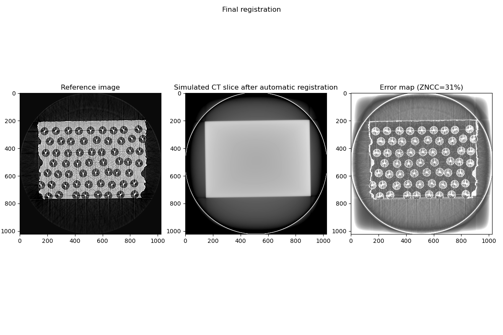


## Find circles

We can use the Hoguh transform to detect where circles are in the image. However, the input image in OpenCV's function must be in UINT8. We blur it using a bilateral filter (an edge-preserving smoothing filter).

### Convert the image to UINT8

We first create a function to convert images in floating point numbers into UINT8.


```python
def float2uint8(anImage):
    uchar_image = copy.deepcopy(anImage);
    uchar_image -= np.min(uchar_image);
    uchar_image /= np.max(uchar_image);
    uchar_image *= 255;
    return uchar_image.astype(np.uint8);
```

We blur the CT scan using a bilateral filter. It preserves edges.


```python
uint8_reference_CT = float2uint8(g_reference_CT);
blurred_reference_CT = cv2.bilateralFilter(uint8_reference_CT, 9, 75, 75);
#np.savetxt("Tutorial2/outputs/blurred_reference_CT.txt", blurred_reference_CT);
volume = sitk.GetImageFromArray(blurred_reference_CT);
volume.SetSpacing([g_pixel_spacing_in_mm, g_pixel_spacing_in_mm, g_pixel_spacing_in_mm]);
sitk.WriteImage(volume, "Tutorial2/outputs/blurred_reference_CT.mha", useCompression=True);
```

### Apply the Hough transform


```python
circles = cv2.HoughCircles(blurred_reference_CT, cv2.HOUGH_GRADIENT, 2, 80,
                            param1=150, param2=5, minRadius=5, maxRadius=15);
```

### Overlay the detected circles on the top of the image


```python
cimg = cv2.cvtColor(blurred_reference_CT, cv2.COLOR_GRAY2BGR);
circles = np.uint16(np.around(circles));

for i in circles[0,:]:

    # draw the outer circle
    cv2.circle(cimg,(i[0],i[1]),i[2],(0,255,0),2);

    # draw the center of the circle
    cv2.circle(cimg,(i[0],i[1]),2,(0,0,255),3);
```


```python
fig=plt.figure();
imgplot = plt.imshow(cimg);
plt.title("Reference image and detected Tungsten cores");
plt.savefig('Tutorial2/plots/fibre_detection_using_Hough_transform.pdf');
plt.savefig('Tutorial2/plots/fibre_detection_using_Hough_transform.png');
```


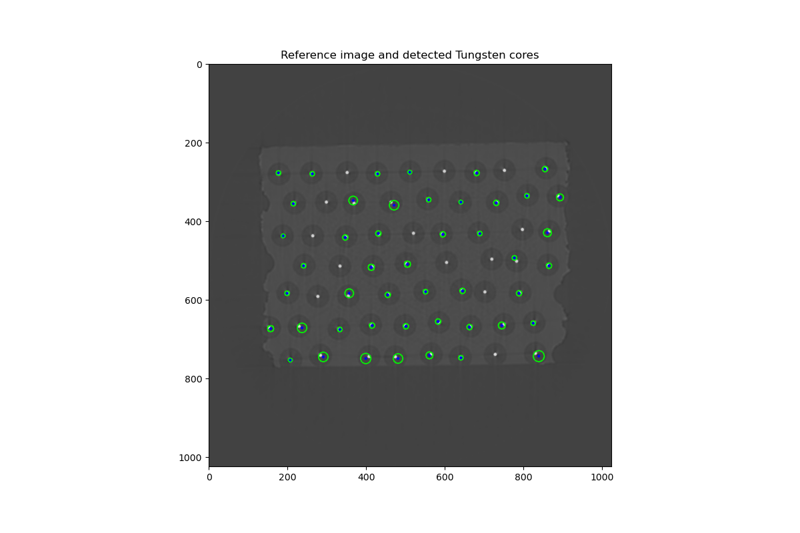


Unlike the previous example, did did not work that well. Here 13 fibres were missed. Many centres are also misplaced. We will use another technique to register the fibres. We will try another technique, the popular Otsu's method. It creates a histogram and use a heuristic to determine a threshold value.


```python
# Convert in UINT8 and into a SITK image
volume = sitk.GetImageFromArray(float2uint8(g_reference_CT));
volume.SetSpacing([g_pixel_spacing_in_mm, g_pixel_spacing_in_mm, g_pixel_spacing_in_mm]);

# Apply the Otsu's method
otsu_filter = sitk.OtsuThresholdImageFilter();
otsu_filter.SetInsideValue(0);
otsu_filter.SetOutsideValue(1);
seg = otsu_filter.Execute(volume);

# Print the corresponding threshold
print("Threshold:", otsu_filter.GetThreshold());
```

    Threshold: 139.0


```python
sitk.WriteImage(seg, "Tutorial2/outputs/cores_segmentation.mha", useCompression=True);
```


```python
fig=plt.figure();
imgplot = plt.imshow(sitk.GetArrayViewFromImage(sitk.LabelOverlay(volume, seg)));
plt.title("Reference image and detected Tungsten cores");
plt.savefig('Tutorial2/plots/fibre_detection_using_otsu_method.pdf');
plt.savefig('Tutorial2/plots/fibre_detection_using_otsu_method.png');
```


### Clean up


```python
cleaned_thresh_img = sitk.BinaryOpeningByReconstruction(seg, [3, 3, 3])
cleaned_thresh_img = sitk.BinaryClosingByReconstruction(cleaned_thresh_img, [3, 3, 3])
```


```python
sitk.WriteImage(cleaned_thresh_img, "Tutorial2/outputs/cores_cleaned_segmentation.mha", useCompression=True);
```


```python
fig=plt.figure();
imgplot = plt.imshow(sitk.GetArrayViewFromImage(sitk.LabelOverlay(volume, cleaned_thresh_img)));
plt.title("Reference image and detected Tungsten cores");
plt.savefig('Tutorial2/plots/fibre_detection_using_otsu_method_after_cleaning.pdf');
plt.savefig('Tutorial2/plots/fibre_detection_using_otsu_method_after_cleaning.png');
```


### Size of objects


The radius of a tungsten core is 30 / 2 um. The pixel spacing is 1.9 um. The radius in number of pixels is $15/1.9  \approx  7.89$. The area of a core is $(15/1.9)^2  \pi  \approx 196$ pixels.


```python
stats = sitk.LabelShapeStatisticsImageFilter()
stats.Execute(sitk.ConnectedComponent(cleaned_thresh_img))

# Look at the distribution of sizes of connected components (bacteria).
label_sizes = [ stats.GetNumberOfPixels(l) for l in stats.GetLabels() if l != 1]

plt.figure()
plt.hist(label_sizes,bins=200)
plt.title("Distribution of Object Sizes")
plt.xlabel("size in pixels")
plt.ylabel("number of objects")
plt.savefig('Tutorial2/plots/distribution_of_core_sizes.pdf');
plt.savefig('Tutorial2/plots/distribution_of_core_sizes.png');
```


## Mark each potential tungsten corewith unique label


```python
fig=plt.figure();
imgplot = plt.imshow(sitk.GetArrayViewFromImage(sitk.LabelOverlay(volume, sitk.ConnectedComponent(cleaned_thresh_img))));
plt.title("Cleaned Binary Segmentation of the Tungsten cores");
plt.savefig('Tutorial2/plots/fibre_detection_with_label_overlay.pdf');
plt.savefig('Tutorial2/plots/fibre_detection_with_label_overlay.png');
```


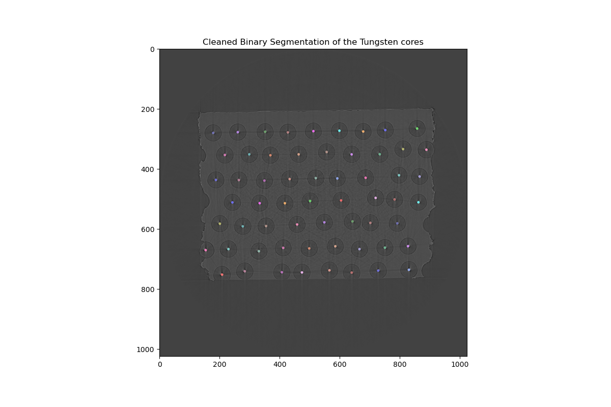


### Object Analysis

Once we have the segmented objects we look at their shapes and the intensity distributions inside the objects. Note that sizes are in millimetres.


```python
shape_stats = sitk.LabelShapeStatisticsImageFilter()
shape_stats.ComputeOrientedBoundingBoxOn()
shape_stats.Execute(sitk.ConnectedComponent(cleaned_thresh_img))

intensity_stats = sitk.LabelIntensityStatisticsImageFilter()
intensity_stats.Execute(sitk.ConnectedComponent(cleaned_thresh_img), volume)
```


```python
centroid_set = [];

for i in shape_stats.GetLabels():
    centroid_set.append(cleaned_thresh_img.TransformPhysicalPointToIndex(shape_stats.GetCentroid(i)));
```


```python
def setFibres(aCentroidSet):

    global core_radius;
    global fibre_radius;

    # Add the geometries
    gvxr.emptyMesh("fibre");
    gvxr.emptyMesh("core");

    number_of_sectors = 100;

    fibre_centre = [0, 0];

    for i, cyl in enumerate(aCentroidSet):

        x = g_pixel_spacing_in_micrometre * -(cyl[0] - g_reference_CT.shape[1] / 2 + 0.5);
        y = g_pixel_spacing_in_micrometre * (cyl[1] - g_reference_CT.shape[0] / 2 + 0.5);

        fibre_centre[0] += x;
        fibre_centre[1] += y;

        gvxr.emptyMesh("fibre_" + str(i));
        gvxr.emptyMesh("core_"  + str(i));

        gvxr.makeCylinder("fibre_" + str(i), number_of_sectors, 815.0, fibre_radius, "micrometer");
        gvxr.makeCylinder("core_"  + str(i), number_of_sectors, 815.0,  core_radius, "micrometer");

        gvxr.translateNode("fibre_" + str(i), y, 0.0, x, "micrometer");
        gvxr.translateNode("core_"  + str(i), y, 0.0, x, "micrometer");

        gvxr.subtractMesh("fibre_" + str(i), "core_" + str(i));

        gvxr.applyCurrentLocalTransformation("fibre_" + str(i));
        gvxr.applyCurrentLocalTransformation("core_" + str(i));

        #gvxr.saveSTLfile("fibre_" + str(i), "Tutorial2/outputs/fibre_" + str(i) + ".stl");
        #gvxr.saveSTLfile("core_" + str(i),  "Tutorial2/outputs/core_"  + str(i) + ".stl");

        gvxr.addMesh("fibre", "fibre_" + str(i));
        gvxr.addMesh("core",  "core_"  + str(i));

    fibre_centre[0] /= len(aCentroidSet);
    fibre_centre[1] /= len(aCentroidSet);

    gvxr.setColor("fibre", 1.0, 0.0, 0.0, 1.0);
    gvxr.setColor("core",  1.0, 0.0, 1.0, 1.0);

    #gvxr.setLinearAttenuationCoefficient("fibre", fibre_mu, "cm-1");
    gvxr.setCompound("fibre", "SiC");
    gvxr.setDensity("fibre", fibre_density, "g/cm3");

    #gvxr.setLinearAttenuationCoefficient("core", core_mu, "cm-1");
    gvxr.setElement("core", "W");

    gvxr.addPolygonMeshAsInnerSurface("core");
    gvxr.addPolygonMeshAsInnerSurface("fibre");
```


```python
setMatrix(current_best);
setFibres(centroid_set);
```


```python
simulated_sinogram, normalised_projections, raw_projections_in_keV = simulateSinogram();
```


```python
# reconstruct the CT slice
theta = g_theta / 180.0 * math.pi;
rot_center = int(simulated_sinogram.shape[2]/2);
reconstruction_tomopy = tomopy.recon(simulated_sinogram, theta, center=rot_center, algorithm="gridrec", sinogram_order=False);
normalised_simulated_CT_with_fibres = (reconstruction_tomopy - reconstruction_tomopy.mean()) / reconstruction_tomopy.std();
```


```python
simulated_sinogram.shape     = (simulated_sinogram.size     // simulated_sinogram.shape[2],     simulated_sinogram.shape[2]);
normalised_projections.shape = (normalised_projections.size // normalised_projections.shape[2], normalised_projections.shape[2]);
raw_projections_in_keV.shape = (raw_projections_in_keV.size // raw_projections_in_keV.shape[2], raw_projections_in_keV.shape[2]);

volume = sitk.GetImageFromArray(simulated_sinogram);
volume.SetSpacing([g_pixel_spacing_in_mm, g_angular_step, g_pixel_spacing_in_mm]);
sitk.WriteImage(volume, "Tutorial2/outputs/simulated_sinogram_with_fibres.mha", useCompression=True);

volume = sitk.GetImageFromArray(normalised_projections);
volume.SetSpacing([g_pixel_spacing_in_mm, g_angular_step, g_pixel_spacing_in_mm]);
sitk.WriteImage(volume, "Tutorial2/outputs/normalised_projections_with_fibres.mha", useCompression=True);

volume = sitk.GetImageFromArray(raw_projections_in_keV);
volume.SetSpacing([g_pixel_spacing_in_mm, g_angular_step, g_pixel_spacing_in_mm]);
sitk.WriteImage(volume, "Tutorial2/outputs/raw_projections_in_keV_with_fibres.mha", useCompression=True);
```


```python
volume = sitk.GetImageFromArray(reconstruction_tomopy);
volume.SetSpacing([g_pixel_spacing_in_mm, g_pixel_spacing_in_mm, g_pixel_spacing_in_mm]);
sitk.WriteImage(volume, "Tutorial2/outputs/simulated_CT_with_fibres.mha", useCompression=True);

volume = sitk.GetImageFromArray(normalised_simulated_CT_with_fibres);
volume.SetSpacing([g_pixel_spacing_in_mm, g_pixel_spacing_in_mm, g_pixel_spacing_in_mm]);
sitk.WriteImage(volume, "Tutorial2/outputs/normalised_simulated_CT_with_fibres.mha", useCompression=True);
```


```python
norm = cm.colors.Normalize(vmax=1.25, vmin=-0.5)

fig, (ax1, ax2, ax3) = plt.subplots(1, 3)
plt.tight_layout()
fig.suptitle('CT slice with fibres after the registration of the matrix')

ax1.set_title("Reference image");
imgplot1 = ax1.imshow(normalised_reference_CT, cmap="gray",
                     norm=norm);

ax2.set_title("Simulated CT slice after automatic registration");
imgplot2 = ax2.imshow(normalised_simulated_CT_with_fibres[0],
                     cmap='gray',
                     norm=norm);

ax3.set_title("Error map (ZNCC=" + str(round(100*np.mean(np.multiply(normalised_simulated_CT_with_fibres[0], normalised_reference_CT)))) + "%)");
imgplot3 = ax3.imshow(np.abs(normalised_simulated_CT_with_fibres[0] - normalised_reference_CT),
                     cmap='gray',
                     norm=norm);
plt.savefig('Tutorial2/plots/simulated_CT_slice_with_fibres_after_cube_registration.pdf');
plt.savefig('Tutorial2/plots/simulated_CT_slice_with_fibres_after_cube_registration.png');
```


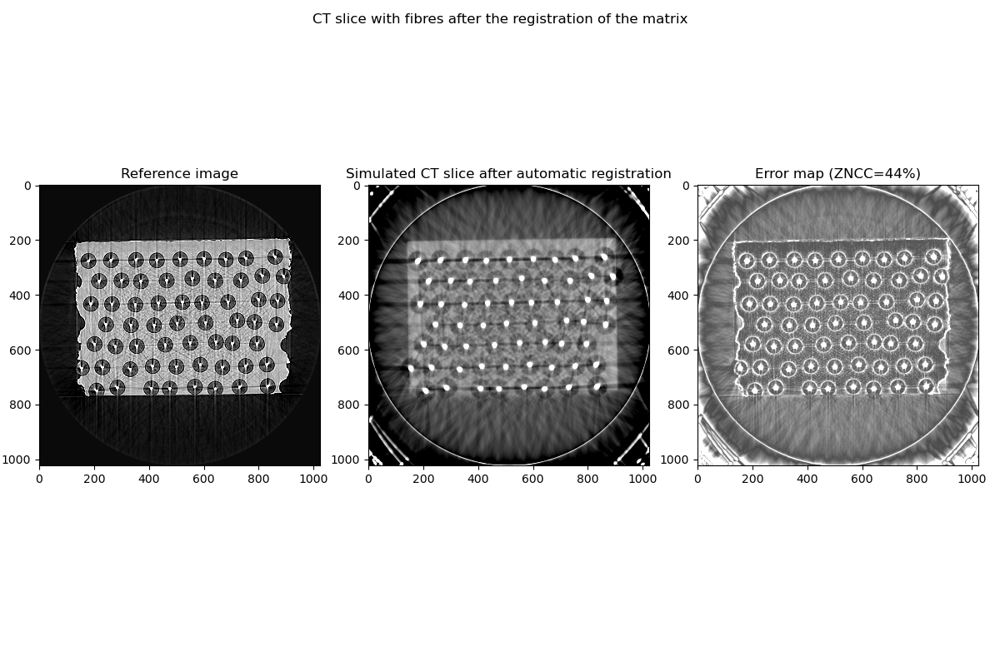


### Optimise fibre radius


```python
def fitnessFunction(x):
    global best_fitness;
    global radius_fibre_id;
    global fibre_radius;
    global core_radius;

    # Get the radii
    fibre_radius = x[0];
    core_radius = fibre_radius * x[1];

    # Load the matrix
    setMatrix(current_best);

    # Load the cores and fibres
    setFibres(centroid_set);

    # Simulate a sinogram
    simulated_sinogram, normalised_projections, raw_projections_in_keV = simulateSinogram();
    normalised_simulated_sinogram = (simulated_sinogram - simulated_sinogram.mean()) / simulated_sinogram.std();

    # Reconstruct the corresponding CT slice
    theta = g_theta / 180.0 * math.pi;
    rot_center = int(simulated_sinogram.shape[2]/2);
    reconstruction_tomopy = tomopy.recon(simulated_sinogram, theta, center=rot_center, algorithm="gridrec", sinogram_order=False);
    normalised_simulated_CT = (reconstruction_tomopy - reconstruction_tomopy.mean()) / reconstruction_tomopy.std();

    # Compute the fitness function
    MAE_CT = np.mean(np.abs(normalised_simulated_CT.flatten() - normalised_reference_CT.flatten()));
    ZNCC_CT = np.mean(np.multiply(normalised_simulated_CT.flatten(), normalised_reference_CT.flatten()));

    MAE = np.mean(np.abs(normalised_simulated_sinogram.flatten() - normalised_reference_sinogram.flatten()));
    ZNCC = np.mean(np.multiply(normalised_simulated_sinogram.flatten(), normalised_reference_sinogram.flatten()));

    # Save the data
    fitness = MAE_CT;
    if best_fitness > fitness:
        best_fitness = fitness;

        volume = sitk.GetImageFromArray(normalised_simulated_CT);
        volume.SetSpacing([g_pixel_spacing_in_mm, g_pixel_spacing_in_mm, g_pixel_spacing_in_mm]);
        sitk.WriteImage(volume, "Tutorial2/outputs/normalised_simulated_CT_radius_fibre_" + str(radius_fibre_id) + ".mha", useCompression=True);

        normalised_simulated_sinogram.shape = (normalised_simulated_sinogram.size // normalised_simulated_sinogram.shape[2], normalised_simulated_sinogram.shape[2]);
        volume = sitk.GetImageFromArray(normalised_simulated_sinogram);
        volume.SetSpacing([g_pixel_spacing_in_mm, g_angular_step, g_pixel_spacing_in_mm]);
        sitk.WriteImage(volume, "Tutorial2/outputs/normalised_simulated_sinogram_radius_fibre_" + str(radius_fibre_id) + ".mha", useCompression=True);

        np.savetxt("Tutorial2/outputs/fibre_radius_" + str(radius_fibre_id) + ".dat", [core_radius, fibre_radius], header='core_radius_in_um,fibre_radius_in_um');

        radius_fibre_id += 1;

        print("Best:", best_fitness, "MAE:", MAE, "ZNCC:", "%.2f" % (100*ZNCC_CT) + "%")

    return fitness;
```


```python
# The registration has already been performed. Load the results.
if os.path.isfile('Tutorial2/outputs/fibre_radius.dat'):
    temp = np.loadtxt('Tutorial2/outputs/fibre_radius.dat');
    core_radius = temp[0];
    fibre_radius = temp[1];
# Perform the registration using CMA-ES
else:
    # An individual is made of two floating point numbers:
    # - the radius of the SiC fibre
    # - the ratio    radius of the W core / radius of the SiC fibre

    fibre_radius = 140 / 2; # um
    core_radius = 30 / 2; # um
    ratio = core_radius / fibre_radius;

    x0 = [fibre_radius, ratio];
    bounds = [[5, 0.01], [1.5 * fibre_radius, 0.95]];

    best_fitness = sys.float_info.max;
    radius_fibre_id = 0;

    opts = cma.CMAOptions()
    opts.set('tolfun', 1e-3);
    opts['tolx'] = 1e-3;
    opts['bounds'] = bounds;
    opts['seed'] = 1;

    es = cma.CMAEvolutionStrategy(x0, 0.9, opts);
    es.optimize(fitnessFunction);

    fibre_radius = es.result.xbest[0];
    core_radius = fibre_radius * es.result.xbest[1];

    np.savetxt("Tutorial2/outputs/fibre_radius.dat", [core_radius, fibre_radius], header='core_radius_in_um,fibre_radius_in_um');
```

    (3_w,6)-aCMA-ES (mu_w=2.0,w_1=63%) in dimension 2 (seed=1, Wed Jan 20 11:29:31 2021)
    Best: 0.5673017 MAE: 0.3317406178290415 ZNCC: 37.09%
    Iterat #Fevals   function value  axis ratio  sigma  min&max std  t[m:s]
        1      6 5.673016905784607e-01 1.0e+00 1.17e+00  1e+00  1e+00 0:11.7
    Best: 0.49882698 MAE: 0.22964753982835 ZNCC: 55.29%
        2     12 4.988269805908203e-01 1.5e+00 1.09e+00  1e+00  1e+00 0:22.8
        3     18 5.484721660614014e-01 1.5e+00 8.43e-01  7e-01  9e-01 0:33.6
        4     24 6.175003051757812e-01 1.6e+00 7.59e-01  6e-01  6e-01 0:44.9
        5     30 6.058545112609863e-01 1.2e+00 6.65e-01  5e-01  5e-01 0:56.8
        6     36 5.375030040740967e-01 1.4e+00 6.48e-01  5e-01  5e-01 1:08.1
    Best: 0.49663484 MAE: 0.17447318196729378 ZNCC: 59.26%
        7     42 4.966348409652710e-01 1.4e+00 6.00e-01  4e-01  4e-01 1:20.0
        8     48 5.437653064727783e-01 1.3e+00 5.65e-01  3e-01  4e-01 1:31.6
        9     54 5.455174446105957e-01 1.2e+00 5.54e-01  3e-01  3e-01 1:42.2
    Best: 0.4965522 MAE: 0.22279744962689096 ZNCC: 56.47%
       10     60 4.965521991252899e-01 1.2e+00 5.42e-01  3e-01  4e-01 1:53.2
       11     66 5.332867503166199e-01 1.7e+00 5.26e-01  3e-01  3e-01 2:04.7
    Best: 0.493382 MAE: 0.20742026465219343 ZNCC: 57.78%
       12     72 4.933820068836212e-01 1.4e+00 4.65e-01  2e-01  2e-01 2:16.6
    Best: 0.4915659 MAE: 0.19090536027123434 ZNCC: 58.80%
       14     84 4.915659129619598e-01 1.6e+00 6.56e-01  3e-01  4e-01 2:39.5
       16     96 4.916691780090332e-01 1.7e+00 5.56e-01  2e-01  4e-01 3:01.5
       18    108 4.919440746307373e-01 2.1e+00 5.48e-01  2e-01  4e-01 3:24.7
       20    120 5.030887126922607e-01 2.5e+00 5.50e-01  1e-01  4e-01 3:49.2
       22    132 4.948120713233948e-01 4.7e+00 8.07e-01  1e-01  8e-01 4:12.1
       24    144 4.921225905418396e-01 7.0e+00 7.03e-01  8e-02  7e-01 4:35.7
       26    156 4.917657971382141e-01 9.8e+00 4.85e-01  4e-02  5e-01 4:58.1
       28    168 4.920329153537750e-01 1.5e+01 4.02e-01  2e-02  4e-01 5:20.0
       30    180 4.921230077743530e-01 2.4e+01 3.18e-01  1e-02  3e-01 5:41.7
       32    192 4.924660325050354e-01 2.5e+01 2.13e-01  7e-03  2e-01 6:04.6
    Best: 0.49155176 MAE: 0.1882811504254847 ZNCC: 58.99%
       34    204 4.915517568588257e-01 2.9e+01 2.78e-01  7e-03  3e-01 6:26.7
    Best: 0.49133512 MAE: 0.18325761398217333 ZNCC: 59.11%
    Best: 0.49066302 MAE: 0.18195872100091726 ZNCC: 58.92%
    Best: 0.4903761 MAE: 0.1794629942008674 ZNCC: 58.89%
    Best: 0.4898726 MAE: 0.1767358613424664 ZNCC: 58.82%
       37    222 4.898726046085358e-01 7.9e+01 7.83e-01  1e-02  1e+00 7:01.2
    Best: 0.4891523 MAE: 0.17592549179600048 ZNCC: 57.76%
    Best: 0.48779598 MAE: 0.14447782271263965 ZNCC: 58.84%
       40    240 4.894686937332153e-01 1.2e+02 2.58e+00  3e-02  6e+00 7:34.9
       43    258 4.881188869476318e-01 1.8e+02 3.25e+00  3e-02  7e+00 8:07.4
    Best: 0.48642185 MAE: 0.12278273529942133 ZNCC: 57.77%
    Best: 0.48598436 MAE: 0.13302166977792562 ZNCC: 58.12%
       46    276 4.867067933082581e-01 3.1e+02 2.32e+00  2e-02  5e+00 8:41.1
       49    294 4.861312508583069e-01 3.8e+02 1.61e+00  1e-02  3e+00 9:14.0
    Best: 0.48579758 MAE: 0.13049432701363975 ZNCC: 57.98%
       52    312 4.863303303718567e-01 4.0e+02 1.28e+00  8e-03  2e+00 9:47.6
    Best: 0.48576427 MAE: 0.1335281091122594 ZNCC: 57.91%
       55    330 4.858448207378387e-01 4.4e+02 1.05e+00  4e-03  1e+00 10:21.3
    Best: 0.48575294 MAE: 0.1326322237316861 ZNCC: 57.95%
       58    348 4.857798218727112e-01 3.6e+02 6.14e-01  2e-03  6e-01 10:55.2
    Best: 0.48573944 MAE: 0.13015925722834915 ZNCC: 57.87%
    Best: 0.48573643 MAE: 0.13010340386589897 ZNCC: 57.91%
       61    366 4.857364296913147e-01 3.9e+02 4.39e-01  1e-03  3e-01 11:28.8
       63    378 4.857665598392487e-01 3.8e+02 6.35e-01  2e-03  4e-01 11:50.8


```python
fibre_registration_image_set = createAnimation("Tutorial2/outputs/normalised_simulated_CT_radius_fibre_",
                'Tutorial2/outputs/fibre_registration.gif');
```


```python
fig, [(ax1, ax2, ax3), (ax4, ax5, ax6), (ax7, ax8, ax9)] = plt.subplots(3, 3)
# plt.tight_layout()
fig.suptitle('Final registration of the matrix and fibres')


ax1.set_title("Reference image");
imgplot1 = ax1.imshow(normalised_reference_CT, cmap="gray",
                     norm=norm);
ax1.axis('off');

ax2.set_title("Cube registration");
imgplot2 = ax2.imshow(cube_registration_image_set[-1],
                     cmap='gray',
                     norm=norm);
ax2.axis('off');

ax3.set_title("Error map (ZNCC=" + str(round(100*np.mean(np.multiply(cube_registration_image_set[-1], normalised_reference_CT)))) + "%)");
imgplot3 = ax3.imshow(np.abs(cube_registration_image_set[-1] - normalised_reference_CT),
                     cmap='gray',
                     norm=norm);
ax3.axis('off');

ax4.set_title("Reference image");
imgplot1 = ax4.imshow(normalised_reference_CT, cmap="gray",
                     norm=norm);
ax4.axis('off');

ax5.set_title("Registered cube with fibres");
imgplot2 = ax5.imshow(normalised_simulated_CT_with_fibres[0],
                     cmap='gray',
                     norm=norm);
ax5.axis('off');

ax6.set_title("Error map (ZNCC=" + str(round(100*np.mean(np.multiply(normalised_simulated_CT_with_fibres[0], normalised_reference_CT)))) + "%)");
imgplot3 = ax6.imshow(np.abs(normalised_simulated_CT_with_fibres[0] - normalised_reference_CT),
                     cmap='gray',
                     norm=norm);
ax6.axis('off');


ax7.set_title("Reference image");
imgplot1 = ax7.imshow(normalised_reference_CT, cmap="gray",
                     norm=norm);
ax7.axis('off');

ax8.set_title("Fibre registration");
imgplot2 = ax8.imshow(fibre_registration_image_set[-1],
                     cmap='gray',
                     norm=norm);
ax8.axis('off');

ax9.set_title("Error map (ZNCC=" + str(round(100*np.mean(np.multiply(fibre_registration_image_set[-1], normalised_reference_CT)))) + "%)");
imgplot3 = ax9.imshow(np.abs(fibre_registration_image_set[-1] - normalised_reference_CT),
                     cmap='gray',
                     norm=norm);
ax9.axis('off');

plt.savefig('Tutorial2/plots/simulated_CT_slice_with_cube_and_fibre_registrations.pdf');
plt.savefig('Tutorial2/plots/simulated_CT_slice_with_cube_and_fibre_registrations.png');
```


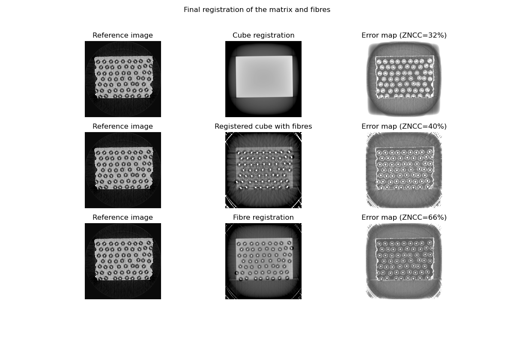


```python
comp_equalized = compare_images(normalised_reference_CT, fibre_registration_image_set[-1], method='checkerboard')

fig=plt.figure();
imgplot = plt.imshow(comp_equalized, cmap='gray', norm=norm);
plt.title("Comparison");
plt.savefig('Tutorial2/plots/comparison.pdf');
plt.savefig('Tutorial2/plots/comparison.png');
```


### Apply the result of the registration


```python
# Load the matrix
setMatrix(current_best);

# Load the cores and fibres
setFibres(centroid_set);

gvxr.saveSTLfile("fibre", "Tutorial2/outputs/fibre.stl");
gvxr.saveSTLfile("core",  "Tutorial2/outputs/core.stl");
```

The 3D view of the registration looks like:


